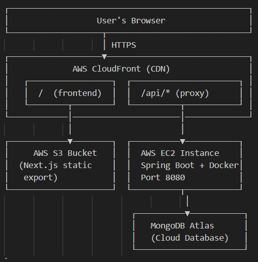
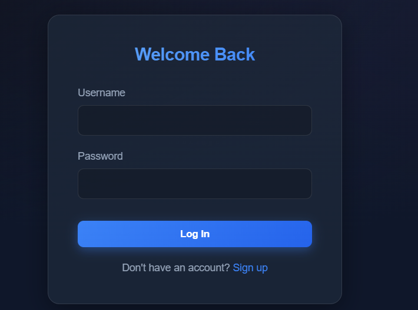
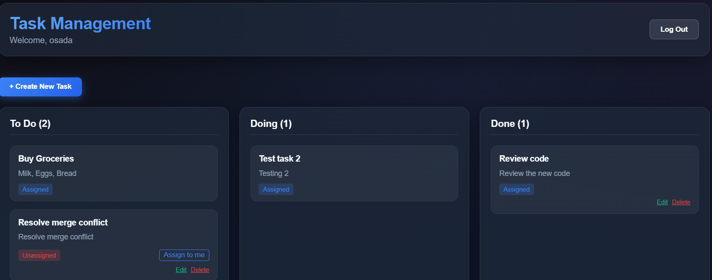
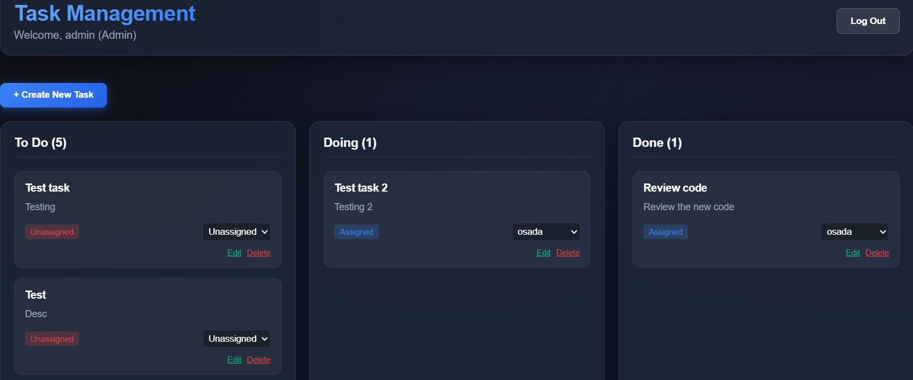

# TaskFlow – ToDo Application

A full-stack, Trello-style task management application built with a **Next.js** frontend, **Spring Boot** backend, and **MongoDB** database. Deployed on AWS with a fully automated GitHub Actions CI/CD pipeline.

**Live Demo:** https://d1qefqlgtaaslb.cloudfront.net

---

## Table of Contents

- [Project Overview](#project-overview)
- [Technology Stack](#technology-stack)
- [Features](#features)
- [Architecture](#architecture)
- [Screenshots](#screenshots)
- [Local Setup](#local-setup)
- [Docker Setup](#docker-setup)
- [Deployment](#deployment)
- [CI/CD Pipeline](#cicd-pipeline)
- [API Reference](#api-reference)

---

## Project Overview

TaskFlow is a role-based task management application where users can create, assign, and track tasks across three workflow columns: **To Do**, **Doing**, and **Done**.

Users are authenticated with **JWT tokens** and interact with a secure REST API. The application enforces **role-based access control (RBAC)** — normal users manage their own tasks while admins have full control over all tasks and users.

---

## Technology Stack

| Layer | Technology |
|---|---|
| **Frontend** | Next.js 15 (App Router), React 19, Vanilla CSS |
| **Backend** | Java 21, Spring Boot 4, Spring Security |
| **Database** | MongoDB (Atlas) |
| **Authentication** | JWT (JSON Web Tokens), BCrypt |
| **Infrastructure** | AWS EC2, AWS S3, AWS CloudFront |
| **Containerisation** | Docker, Docker Compose |
| **CI/CD** | GitHub Actions |
| **IaC** | Terraform |

---

## Features

### Authentication
- User registration with validation (username 3–20 chars, password 6–40 chars)
- JWT-based stateless authentication
- Secure password hashing with BCrypt
- Persistent login via localStorage token

### Task Management
- Create tasks with title and description
- Tasks organised in three columns: **To Do**, **Doing**, **Done**
- Move tasks between columns via status update
- Assign tasks to yourself or other users (admin only)

### Role-Based Access Control
| Action | Normal User | Admin |
|---|---|---|
| View all tasks | ✅ | ✅ |
| Create tasks | ✅ | ✅ |
| Edit own tasks | ✅ | ✅ |
| Delete own tasks | ✅ | ✅ |
| Edit any task | ❌ | ✅ |
| Delete any task | ❌ | ✅ |
| Assign tasks to any user | ❌ | ✅ |

### UI/UX
- Modern glassmorphism dark theme
- Smooth micro-animations and hover effects
- Responsive layout
- Real-time task board updates

---

## Architecture

```
┌─────────────────────────────────────────────────┐
│                  User's Browser                 │
└───────────────────┬─────────────────────────────┘
                    │ HTTPS
┌───────────────────▼─────────────────────────────┐
│             AWS CloudFront (CDN)                │
│   ┌─────────────────┐  ┌──────────────────────┐ │
│   │  /  (frontend)  │  │  /api/* (proxy)      │ │
│   └────────┬────────┘  └──────────┬───────────┘ │
└────────────│──────────────────────│─────────────┘
             │                      │
┌────────────▼────────┐  ┌──────────▼───────────┐
│     AWS S3 Bucket   │  │  AWS EC2 Instance    │
│  (Next.js static    │  │  Spring Boot + Docker│
│   export)           │  │  Port 8080           │
└─────────────────────┘  └──────────┬───────────┘
                                     │
                          ┌──────────▼───────────┐
                          │   MongoDB Atlas      │
                          │   (Cloud Database)   │
                          └──────────────────────┘
```

---

## Screenshots

> **Login Page** — JWT-secured authentication with error handling  


> **Register Page** — User registration with client-side validation  


> **Dashboard** — Task board with To Do, Doing, and Done columns, task cards showing assignment status, and Edit/Delete controls  


> **Admin User Dashboard** — Task board with To Do, Doing, and Done columns, task cards showing assignment status, and assigning tasks to users  


---

## Local Setup

### Prerequisites

- Java 21+
- Node.js 20+
- MongoDB (local or [MongoDB Atlas](https://www.mongodb.com/atlas))

### 1. Clone the repository

```bash
git clone https://github.com/osadaRajapaksha/ToDoApplication.git
cd ToDoApplication
```

### 2. Backend

Create an `application.properties` override or set environment variables:

```bash
# Required environment variables
export SPRING_DATA_MONGODB_URI=mongodb://localhost:27017
export JWT_SECRET=your-secret-key-at-least-256-bits-long
export APP_FRONTEND_URL=http://localhost:3000
```

Run the backend:

```bash
cd backend
./mvnw spring-boot:run
# Windows: .\mvnw spring-boot:run
```

The API will be available at `http://localhost:8080`.

**Default admin account** (created automatically on first run):
- Username: `admin`
- Password: `admin123`

### 3. Frontend

```bash
cd frontend
npm install
npm run dev
```

Open `http://localhost:3000` in your browser.

---

## Docker Setup

The entire stack can be run with Docker Compose. Create a `.env` file in the project root:

```env
SPRING_DATA_MONGODB_URI=<your-mongodb-atlas-uri>
JWT_SECRET=<your-secret-key>
APP_FRONTEND_URL=http://localhost:3000
```

Then run:

```bash
docker-compose up -d --build
```

| Service | Port |
|---|---|
| Backend API | http://localhost:8080 |

---

## Deployment

The application is deployed on AWS with the following resources:

| Resource | Purpose |
|---|---|
| **CloudFront** | CDN — serves frontend + proxies `/api/*` to backend |
| **S3 Bucket** | Hosts the Next.js static export |
| **EC2 (t3.small)** | Runs the Spring Boot backend in Docker |
| **MongoDB Atlas** | Managed cloud database |

Infrastructure is provisioned with **Terraform** (see the `terraform/` directory).

### Required Environment Variables (Production)

| Variable | Description |
|---|---|
| `SPRING_DATA_MONGODB_URI` | MongoDB Atlas connection string |
| `JWT_SECRET` | Secret key for signing JWT tokens (min 256 bits) |
| `APP_FRONTEND_URL` | The CloudFront URL of the deployed frontend |

> ⚠️ **Never commit real credentials.** Use environment variables or a secrets manager.

---

## CI/CD Pipeline

Every push to `master` automatically triggers the GitHub Actions pipeline defined in [`.github/workflows/deploy.yml`](.github/workflows/deploy.yml):

```
Push to master
      │
      ├─ backend-build   →  mvn package (compile + test)
      │
      ├─ backend-deploy  →  SSH to EC2 → git pull → docker-compose up --build
      │       └─ health check (verifies API is responding)
      │
      └─ frontend-deploy →  npm ci → npm run build → s3 sync → CloudFront invalidation
```

### GitHub Actions Secrets Required

| Secret | Description |
|---|---|
| `AWS_ACCESS_KEY_ID` | IAM user access key for S3/CloudFront |
| `AWS_SECRET_ACCESS_KEY` | IAM user secret key |
| `S3_BUCKET_NAME` | S3 bucket name for the frontend |
| `CLOUDFRONT_DISTRIBUTION_ID` | CloudFront distribution ID |
| `EC2_HOST` | Public IP of the EC2 instance |
| `EC2_USER` | SSH user (e.g. ec2-user) |
| `EC2_SSH_PRIVATE_KEY` | Private key for SSH access to EC2 |
| `SPRING_DATA_MONGODB_URI` | MongoDB connection string |
| `JWT_SECRET` | JWT signing secret |
| `APP_FRONTEND_URL` | The CloudFront frontend URL |

---

## API Reference

All endpoints are prefixed with `/api`.

### Auth

| Method | Endpoint | Description | Auth |
|---|---|---|---|
| `POST` | `/api/auth/signup` | Register a new user | Public |
| `POST` | `/api/auth/signin` | Login and receive a JWT | Public |

### Tasks

| Method | Endpoint | Description | Auth |
|---|---|---|---|
| `GET` | `/api/tasks` | Get all tasks | Required |
| `POST` | `/api/tasks` | Create a new task | Required |
| `PUT` | `/api/tasks/{id}` | Update a task | Required |
| `DELETE` | `/api/tasks/{id}` | Delete a task | Required |

### Users

| Method | Endpoint | Description | Auth |
|---|---|---|---|
| `GET` | `/api/users` | List all users | Admin only |

> **Authentication:** Include the JWT token in the `Authorization` header as `Bearer <token>`.
